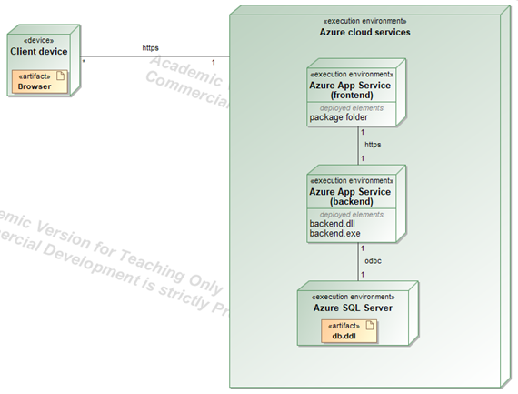
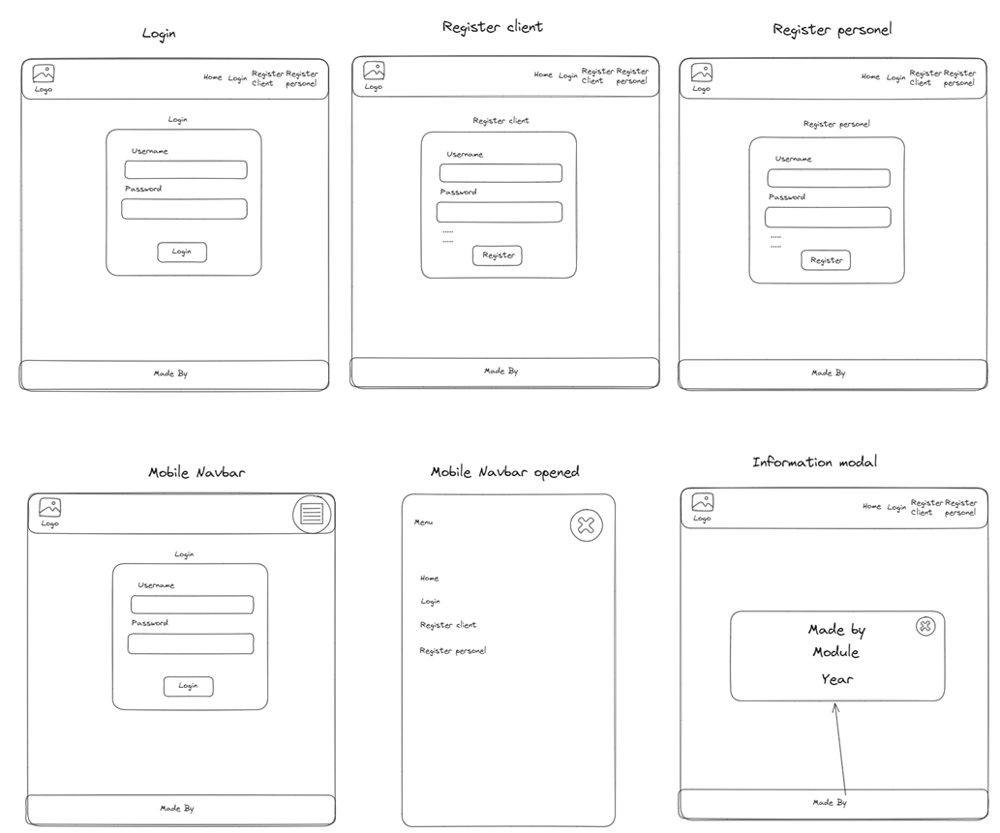
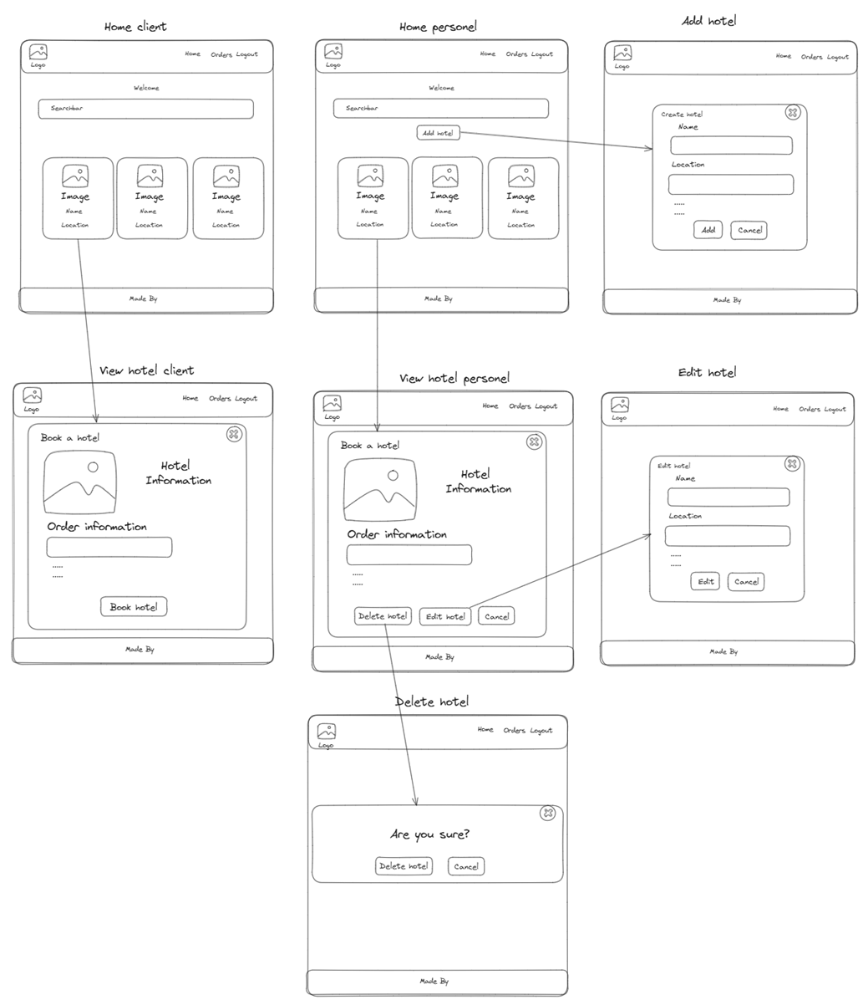
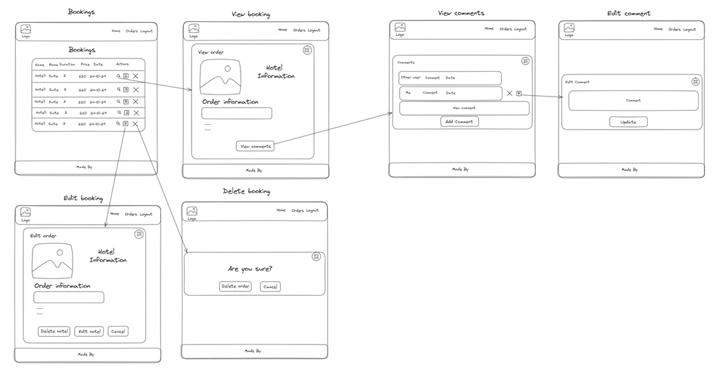

# Viešbučių rezervacijos sistema

## Pavadinimas:
Viešbučių rezervacijos sistema

## Sistemos paskirtis:
Kuriamos sistemos pagrindinė idėja palengvinti keliaujančių žmonių nakvynės vietos suradimui ir rezervavimui. Viešbučių atstovai šiame puslapyje gali patalpinti savo viešbučio informaciją, kaip viešbučio aprašymą nuotrauką ir nurodyti kainas skirtingos kambarių rezervacijoms, taip siekiant pritraukti naujų klientų į savo verslą. Neregistruoti sistemos naudotojai, gali peržiūrėti skirtingus viešbučius ir jų siūlomas kainas. Norint užsirezervuoti kambarį neregistruotas naudotojas turi užsiregistruoti sistemoje kaip narys. Tai padaręs klientas gali užsirezervuoti sau kambarį. Sistemos naudotojas sukūręs rezervaciją sistemoje ją gali peržiūrėti visose savo rezervacijose. Čia taip pat galima rezervaciją koreguoti ir atšaukti. Jeigu yra poreikis, klientas gali paliktį prie rezervacijos komentarą, vėliau šį komentarą galima redaguoti ir pašalinti. Prie kliento rezervacijos, komentarų skiltyje viešučio darbuotojas taip pat gali palikti savo komentarą, tai atsakydamas į prieš tai buvusį kliento komentarą.

## Pagrindiniai sistemos funkciniai reikalavimai:
- Registracija ir prisijungimas prie sistemos naudotojams
- Viešbučio peržiūra, sukūrimas, redagavimas, ištrynimas 
- Rezervacijos sukūrimas, peržiūra, redagavimas, ištrynimas
- Komentaro prie rezervacijos palikimas, peržiūra, redagavimas, ištrynimas
- Sistema turi palaikyti tris roles: svečias, klientas, vadybininkas
- Pagrindiniame lange yra paieškos langas, kruis suranda viešbučius pagal jų lokacijas
- Reaguojantis į ekrano dydį navigacijos laukas
- Modalinis langas su naudinga informacija

## Pagrindiniai sistemos nefunkciniai reikalavimai:
- Reaguojantis į ekrano dydį dizainas
- Nuotraukų dydžio prisitaikymas
- Antraštė, turinys ir poraštė yra skirtingo stiliaus ir funkcionalumo
- Panaudoti animacijas pagyvinti svetainę
- Panaudoti vektorines ikonas
- Parinkti besiderinančias turinio spalvas
- Elementai gražiai lygiuoti pagal taisykles
- Elementų matomumas ir pasiekiamumas neturi būti apsunkintas
- Įvedimo formos turi būti aiškios ir nuoseklios
- Naudotojo sąsajos grafinis dizainas turi būti vientisas, atitikti projekto užduotį

## Naudojamos technologijos:
- Serverio dalis bus parašyta naudojant ASP .NET CORE 
- Kliento dalis bus rašoma su React JS, stiliams naudojamas MUI ir bendrauti su serverine dalimi palengvinimui tanstack react-query client
- Naudosime Microsoft Azure SQL duomenų bazę
- Sukurta sistema bus patalpinta Microsoft Azure debesijos platformoje

## Github repozitorijos nuoroda:
https://github.com/PauliusPreiksaCode/saitynai-hotel

## Sistemos diegimo diagrama:

## Naudotojo sąsajos projektas

